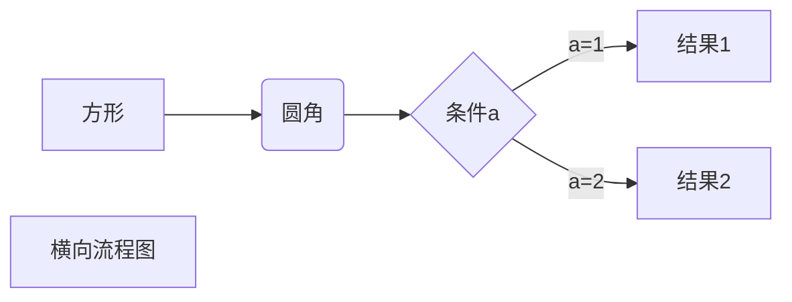
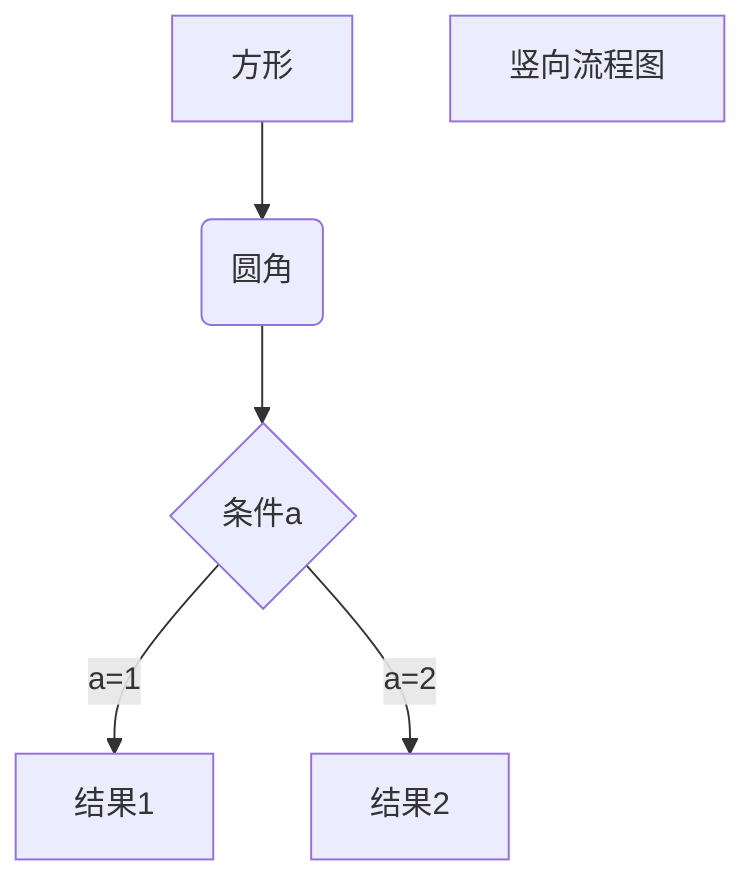
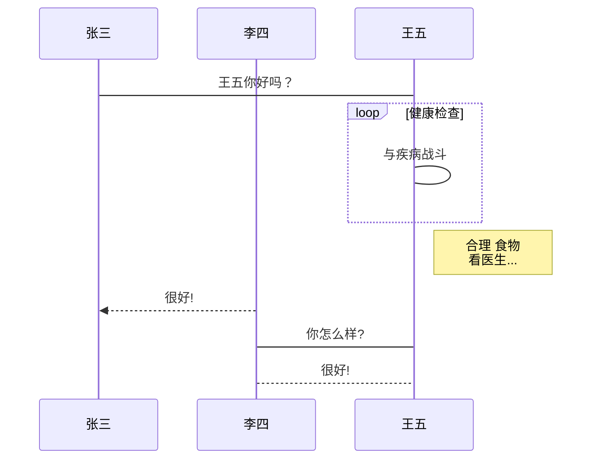
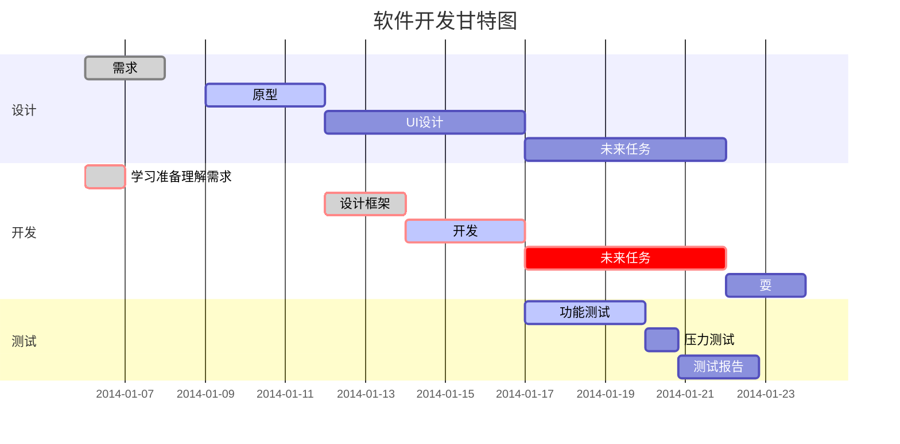

# 阶段一 Markdown学习笔记

   * [阶段一 Markdown学习笔记](#阶段一-markdown学习笔记)
      * [一、Markdown初印象](#一markdown初印象)
         * [1.1 Markdown概述](#11-markdown概述)
         * [1.2 Markdown工作过程](#12-markdown工作过程)
         * [1.3 Markdown应用场景](#13-markdown应用场景)
      * [二、Typora~轻便简洁的Markdown编辑器相关使用事宜](#二typora轻便简洁的markdown编辑器相关使用事宜)
      * [三、Markdown语法规范](#三markdown语法规范)  
         * [样式流程图](#样式流程图)  
         * [带样式时序流程图](#带样式时序流程图)  
         * [甘特图](#甘特图)  
      * [四、Typora快捷键整理](#四typora快捷键整理)
      * [五、学习Markdown语法以及其编辑器器Typora过程中所参考的网站及教程](#五学习markdown语法以及其编辑器器typora过程中所参考的网站及教程)
      * [六、Markdown以及其编辑器Typora的初步学习的心得总结](#六markdown以及其编辑器typora的初步学习的心得总结)
         * [6.1 个人心得体会](#61-个人心得体会)
         * [6.2 在初步学习Markdown以后目前依然存在的问题](#62-在初步学习markdown以后目前依然存在的问题)
         * [6.3 总结](#63-总结)
      * [七、typora的彩蛋（学长指点）](#七typora的彩蛋（学长指点）)

## 一、Markdown初印象

### 1.1 Markdown概述

> Markdown是一种[轻量级标记语言](https://baike.baidu.com/item/轻量级标记语言/52671915)，创始人为约翰·格鲁伯（英语：John Gruber）。 它允许人们使用易读易写的纯文本格式编写文档，然后转换成有效的XHTML（或者HTML）文档。这种语言吸收了很多在电子邮件中已有的纯文本标记的特性。

> 由于Markdown的轻量化、易读易写特性，并且对于图片，图表、数学式都有支持，目前许多网站都广泛使用Markdown来撰写帮助文档或是用于论坛上发表消息。 如[GitHub](https://baike.baidu.com/item/GitHub/10145341)、[Reddit](https://baike.baidu.com/item/Reddit/1272010)、[Diaspora](https://baike.baidu.com/item/Diaspora/10726893)、Stack Exchange、[OpenStreetMap](https://baike.baidu.com/item/OpenStreetMap/3171606) 、[SourceForge](https://baike.baidu.com/item/SourceForge/6562141)、[简书](https://baike.baidu.com/item/简书/5782216)等，甚至还能被使用来撰写电子书 。
>


### 1.2 Markdown工作过程

1. 创建.md扩展名文件
2. 在Markdown应用程序打开文件
3. Markdown应用程序中的Markdown处理器将文件处理，转换成HTML或pdf等可打印文档
4. 最终可以使用如Typora、浏览器等其他应用程序查看


### 1.3 Markdown应用场景

1. 使用Markdown创建网站内容
2. 使用Markdown语言编辑基本文档


## 二、Typora~轻便简洁的Markdown编辑器相关使用事宜

1. 首先要打开文件—**偏好设置**—勾选上标、下标、高亮、图表选项（使得其相应功能可以显示）

2. 设置完成以后记得**重启Typora**

3. 如果想要在Typora中写下演示的事例，但是又不想被编辑器识别，我通过将所写的东西放入代码块中解决此问题

4.  **tip:** 可以根据个人喜好决定是否关闭严格模式

   **严格模式:** 在严格模式下，如果要输入**标题 ，**则必须在字符之后设置空格；在严格模式下，如果要在列表项中创建新块/段落，则必须输入足够的空白缩进，使新段落与上一段严格对齐。
   
   **ps:** 在我写笔记的过程中发现，关闭严格模式，提高Typora的容错率，确实可以加快编写的速度。
   
   但是我最终的建议是不建议关闭严格模式，因为关闭严格模式后，markdown语法与GitHub上的不兼容，很多效果没有正常显示


## 三、Markdown语法规范

1. **分级标题**

   ```
   # 一级标题
   ## 二级标题
   ### 三级标题
   #### 四级标题
   ##### 五级标题
   ###### 六级标题  <!--最多6级标题-->
   ```

2. **强调**

```
*This text will be italic*（包括在两个*之间的文字为斜体，其他类似）
_This will also be italic_（斜体）
**This text will be bold**（黑体）
__This will also be bold__（黑体）
~~This text will be deleted~~（删除线）
_You **can** combine them_（可以多种格式复合使用）
```

强调效果如下

*This text will be italic*（包括在两个*之间的文字为斜体，其他类似）
_This will also be italic_（斜体）
**This text will be bold**（黑体）
__This will also be bold__（黑体）
~~This text will be deleted~~（删除线）
_You **can** combine them_（可以多种格式复合使用）

3. **列表**

* 无序列表

  ```
  * Item 1
  * Item 2
   *Item 2a
   *Item 2b
  ```

  tip.==无序列表用 - + * 任何一种都可以，注意符号和文字之间**有空格**！==

* 顺序列表

  ```
  1. Item 1
  2. Item 2
  3. Item 3
  ```

* 列表的嵌套

  在父层的基础上，子层在开头加两个空格（1个Tab）即可。

  ```
  以下为两种不同形式的嵌套
  1. Item 2（有序嵌套无序）
   *Item 2a（无序）
   *Item 2b（无序）
  1. Item 3（有序嵌套有序）
   1. Item 3a
   1. Item 3b
   无序的嵌套也依然雷同，就不一一赘述
  ```

4. **引用**

   引用的内容可以用 **>**来表示

   ```
   > We're living the future so
   > the present is our past.
   ```

   引用效果如下

   > We're living the future so
   > the present is our past.

   5.**行内代码**

​	代码之间分别用一个反引号（`）包起来。

```
` print 'Hello world!' `
```

​    行内代码效果如下

` print 'Hello world!' `

 6.**代码块**

​    连用三个反引号（```）将代码包起来

```
​```
def f(x):
  return x**2 + 2*x + 1
​```
```

代码块效果如下

```
def f(x):
  return x**2 + 2*x + 1
```

  7.**分割线**

​     三个或者三个以上的 - 或者 * 都可以。


---
***


​	分割线效果如下

---
***

8. **插入对象**

* **表格**

  表格的插入非常简单，只需要按照如下语法画出表格形状即可，在编辑代码时不需要考虑对齐（但是为了美观和逻辑的直观，建议代码整齐）。竖线（|）用于分栏，短横线（-）用于分割表头和其余部分，冒号（:）用于标记表格内容的对齐方式（默认为左对齐）。

  ```
  |表头|表头|表头|
  |:--|:--:|--:|(包括三种对齐方式)
  |内容|内容|内容|
  |内容|内容|内容|
  |内容|内容|内容|
  ```

  表格插入效果如下

  | 表头 | 表头 | 表头 |
  | :--- | :--: | ---: |
  | 内容 | 内容 | 内容 |
  | 内容 | 内容 | 内容 |
  | 内容 | 内容 | 内容 |

* **图像**

  用 **** 可以添加在线图片或本地图片，其中标题为**可选项**(名称自己起)。

  ```
  
  ```

  图像插入效果如下

  

* **链接**

  * **行内式链接**

    用`[名称](地址 "标题")`可以添加超链接，语法和添加图片类似，只是少了叹号。
  
  ```
[临安](https://www.namedq.com/ht/262315.html)
  行内式链接插入效果如下

  [临安](https://www.namedq.com/ht/262315.html)

  * **参考式链接**
  
    参考式链接分为两部分，文中的写法 [链接文字][链接标记]，在文本的任意位置添加[链接标记]:链接地址。
  
  ```
    我是从[Google][1]上搜索到的[临安][2]。
  [1]: http://www.google.com
  [2]: https://www.namedq.com/ht/262315.html
    ```
  
  参考式链接插入效果如下
  
  我是从[Google][1]上搜索到的[临安][2]。
  
  [1]:http://www.google.com
  [2]:https://www.namedq.com/ht/262315.html
    ```

9. **高亮**（需要勾选扩展语法）

   ```
   ==高亮==
   ```

   高亮效果如下

   ==高亮==

   **PS:** 不推荐使用，GitHub上无法显示

10. **下划线**

    ```
    <u>带下划线文本</u>
    ```

    下划线效果如下：

    <u>带下划线文本</u>

11. **上标**

    ```
    H<sub>2</sub>o
    ```

    上标效果如下：

    H<sub>2</sub>o

12. **下标**

    ```
    CO<sub>2</sub>
    ```

    下标效果如下：

    CO<sub>2</sub>

13. **表情符号**

    加入所需表情的英文：即可完成表情符号的输入

    ```
    :smile:
    ```

    表情符号效果如下：

    :smile:

14. **加入特殊符号**

    如果想要插入以上内容中用到的一些符号（字面上，而非功能性应用），比如希望插入星号（*），但不是用这个星号来表示斜体或加粗等，那么可以在符号前面加反斜线（\）以插入这些普通符号。

    ```
    \ 反斜线
    ` 反引号
    * 星号
    _ 底线
    {} 花括号
    [] 方括号
    () 括弧
    # 井字号
    + 加号
    - 减号
    . 英文句点
    ! 惊叹号
    ```

15. **脚注**

    脚注可以用于编辑参考文献。

    ```
    在文中使用[^1]的方式标记脚注，
    在文末使用[^1]:加入参考文献，注意要使用英文冒号，后面有无空格均可。
    ```

    例如“程心坐在夜色中，坐在对这巨变中的世界无动于衷的群星下，直到东方发白。”[^3]

    [^3]:摘自《三体3 死神永生》
    
16. **流程图**

* ##### 样式流程图

  * 基本语法

    - `graph` 指定流程图方向：`graph LR` 横向，`graph TD` 纵向
    - 元素的形状定义：
      - `id[描述]` 以直角矩形绘制
      - `id(描述)` 以圆角矩形绘制
      - `id{描述}` 以菱形绘制
      - `id>描述]` 以不对称矩形绘制
      - `id((描述))` 以圆形绘制
    - 线条定义：
      - `A-->B` 带箭头指向
      - `A---B` 不带箭头连接
      - `A-.-B` 虚线连接
      - `A-.->B` 虚线指向
      - `A==>B` 加粗箭头指向
      - `A--描述---B` 不带箭头指向并在线段中间添加描述
      - `A--描述-->B` 带描述的箭头指向
      - `A-.描述.->B` 带描述的虚线连指向
      - `A==描述==>B` 带描述的加粗箭头指向
    - 子流程图定义：

    ```
    subgraph title
        graph direction
    end
    ```

    横向流程图举例说明

```
​```mermaid
graph LR
A[方形] -->B(圆角)
    B --> C{条件a}
    C -->|a=1| D[结果1]
    C -->|a=2| E[结果2]
    F[横向流程图]
​```
```

横向流程图效果如下



纵向流程图举例说明

```
​```mermaid
graph TD
A[方形] --> B(圆角)
    B --> C{条件a}
    C --> |a=1| D[结果1]
    C --> |a=2| E[结果2]
    F[竖向流程图]
​```
```

纵向流程图效果如下



标准流程图举例说明

```
​```flow
st=>start: 开始框
op=>operation: 处理框
cond=>condition: 判断框(是或否?)
sub1=>subroutine: 子流程
io=>inputoutput: 输入输出框
e=>end: 结束框
st->op->cond
cond(yes)->io->e
cond(no)->sub1(right)->op
​```
```

标准流程图效果如下

```flow
st=>start: 开始框
op=>operation: 处理框
cond=>condition: 判断框(是或否?)
sub1=>subroutine: 子流程
io=>inputoutput: 输入输出框
e=>end: 结束框
st->op->cond
cond(yes)->io->e
cond(no)->sub1(right)->op
```

* 标准时序流程图

  基本语法：

  - `Title:标题` ：指定时序图的标题

  - `Note direction of 对象:描述` ： 在对象的某一侧添加描述，`direction` 可以为 `right/left/over` ， `对象` 可以是多个对象，以 `,` 作为分隔符

  - `participant 对象` ：创建一个对象

  - `loop...end` ：创建一个循环体

  - ```
    对象A->对象B:描述： 绘制A与B之间的对话，以实线连接
    ```

    - `->` 实线实心箭头指向
    - `-->` 虚线实心箭头指向
    - `->>` 实线小箭头指向
    - `-->>` 虚线小箭头指向

时序流程图举例说明

```
​```sequence
对象A->对象B: 对象B你好吗?（请求）
Note right of 对象B: 对象B的描述
Note left of 对象A: 对象A的描述(提示)
对象B-->对象A: 我很好(响应)
对象A->对象B: 你真的好吗？
​```
```

时序流程图效果如下

```sequence
对象A->对象B: 对象B你好吗?（请求）
Note right of 对象B: 对象B的描述
Note left of 对象A: 对象A的描述(提示)
对象B-->对象A: 我很好(响应)
对象A->对象B: 你真的好吗？
```

* #####  带样式时序流程图

  基本语法同标准时序图，不同的是

  - 需要使用 `mermaid` 解析，并在开头使用关键字 `sequenceDiagram` 指明
  - 线段的样式遵循mermaid的解析方式
    - `->` ： 实线连接
    - `-->` ：虚线连接
    - `->>` ：实线箭头指向
    - `-->>` ：虚线箭头指向

 带样式时序流程图举例说明

```
​```mermaid
%% 时序图例子,-> 直线，-->虚线，->>实线箭头
  sequenceDiagram
    participant 张三
    participant 李四
    张三->王五: 王五你好吗？
    loop 健康检查
        王五->王五: 与疾病战斗
    end
    Note right of 王五: 合理 食物 <br/>看医生...
    李四-->>张三: 很好!
    王五->李四: 你怎么样?
    李四-->王五: 很好!
​```
```

带样式的时序流程图效果如下



* #### 甘特图

  基本语法：

  - 使用 `mermaid` 解析语言，在开头使用关键字 `gantt` 指明
  - `deteFormat 格式` 指明日期的显示格式
  - `title 标题` 设置图标的标题
  - `section 描述` 定义纵向上的一个环节
  - 定义步骤：每个步骤有两种状态done（已完成）/active（执行中）
    - `描述: 状态,id,开始日期,结束日期/持续时间`
    - `描述: 状态[,id],after id2,持续时间`
    - `crit` ：可用于标记该步骤需要被修正，将高亮显示
    - 如果不指定具体的开始时间或在某个步骤之后，将默认依次顺序排列

甘特图举例说明

```
​```mermaid
%% 语法示例
        gantt
        dateFormat  YYYY-MM-DD
        title 软件开发甘特图
        section 设计
        需求                      :done,    des1, 2014-01-06,2014-01-08
        原型                      :active,  des2, 2014-01-09, 3d
        UI设计                     :         des3, after des2, 5d
    未来任务                     :         des4, after des3, 5d
        section 开发
        学习准备理解需求                      :crit, done, 2014-01-06,24h
        设计框架                             :crit, done, after des2, 2d
        开发                                 :crit, active, 3d
        未来任务                              :crit, 5d
        耍                                   :2d
        section 测试
        功能测试                              :active, a1, after des3, 3d
        压力测试                               :after a1  , 20h
        测试报告                               : 48h
​```
```

甘特图效果如下




## 四、Typora快捷键整理

- 选中一整行：ctrl+l

- 选中单词：ctrl+d

- 选中相同格式的文字：ctrl+e

- 跳转到文章开头：ctrl+home

- 跳转到文章结尾：ctrl+end

- 搜索：ctrl+f

- 替换：ctrl+h

- 代码块：ctrl+alt+f

- 加粗：ctrl+b

- 倾斜：ctrl+i

- 下划线：ctrl+u

- 删除线：alt+shift+5

- 插入图片：直接拖动到指定位置即可或者ctrl+shift+i

- 插入链接：ctrl + k

- 插入表格：Ctrl+T

- 插入有序列表：Ctrl+Shift+[

- 插入无序列表：Ctrl+Shift+]

- 插入超链接：Ctrl+K

- 插入公式块：Ctrl+Shift+M

- 插入引用块：Ctrl+Shift+Q

- 一至六级标题：Ctrl+1–6

- 提升标题级别：Ctrl+‘+’

- 降低标题级别：Ctrl+‘-’

- 源代码模式：Ctrl+/

  

---


## 五、学习Markdown语法以及其编辑器器Typora过程中所参考的网站及教程

1. 参考网站

* [Markdown学习笔记：简明的入门教程](https://www.jianshu.com/p/c68e1b52cba0)
* [【Markdown】列表的嵌套](https://www.jianshu.com/p/d771e7397c37)
* [Markdown基础——概述、工作原理以及用途](https://blog.csdn.net/junecscscs/article/details/89435699)
* [为什么要学Markdown？有什么用？](https://zhuanlan.zhihu.com/p/92312642)
* [Typora入门：全网最全教程](https://www.cnblogs.com/hider/p/11614688.html)
* [Markdown 高级技巧](https://www.runoob.com/markdown/md-advance.html)
* [Markdown中如何添加特殊符号](https://blog.csdn.net/Logicr/article/details/82414854)
* [Markdown 使用 Emoji 表情](https://markdown.com.cn/extended-syntax/emoji.html)
* [markdown中实现下标与上标的方法](https://blog.csdn.net/WeiLanooo/article/details/102622917)
* [Markdown语法大全(超级版)](https://www.jianshu.com/p/ebe52d2d468f)
* [Markdown 代码块与语法高亮](https://www.jianshu.com/p/65ab196bef04)

2. 参考教程

* [Markdown保姆级教程之基础篇（Typora使用教程）](https://www.bilibili.com/video/BV1d741147k2)
* [Markdown保姆级教程之画图篇（流程图、序列图、饼图、甘特图）](https://www.bilibili.com/video/BV1C7411V7SF?t=164)


## 六、Markdown以及其编辑器Typora的初步学习的心得总结

### 6.1 个人心得体会

在此次对Markdown以及其编译器Typora的初步学习过程中，才发现很多网站（如知乎、简书、CSDN等）中的博客都是用此类语法编辑的博客文章。相比较Typora与word来说，Typora的极简风格以及其由于体积小带来的快速流畅的界面初始化体验确实令我倾心。另外Typora的各种标记符号虽然简单，但是却出人意料的可以满足各种需求，并且没有那种各种细分导致用户眼花缭乱的感觉。最让我开心的是Typora的自动匹配括号、引号功能真的是太赞了:thumbsup:。

在使用了GitHub以后我又注意到了Markdown的实时浏览功能，因为GitHub中浏览和源代码是分开的，需要转换过程，但是在Typora中，在我完成一行文本离开正在编辑的段落后， Markdown 标记会被自动隐藏。这样就可以根据此时的效果来看实际效果是否与预期一致，很方便就可以完成对文本编辑格式的检查。


### 6.2 在初步学习Markdown以后目前依然存在的问题

1. 对于Typora的公式编辑目前依然没有完全理解

2. 在本地图片传输到Typora上以后一旦传输给别人如何让本地图片链接依然发挥作用可以正常查看

   

### 6.3 总结

通过这一段时间对Markdown及其编辑器Typora的初步学习，掌握了一些基本的语法规范和一些基础的操作，但是依然有缺乏的地方，在未来的应用中我会继续探索Typora的应用方式，熟练操作并补足相关的知识漏洞。

---


## 七、typora的彩蛋（学长指点）

其实应该是说.md文件的本质

事实上无论是typora还是GitHub页面本质上都只是一个带有样式修饰的HTML页面，只不过是被渲染转化了

**证据:**  如果使用shift+F12就可以在typora中打开开发者工具，之后就会看到它的本质就是一个前端，而且内嵌了一个类似chrome的调试工具

因此html语法在markdown语法中也可以生效，比如插入图片直接使用HTML语法img也可以，然后使用height或者width来控制图片大小

**PS:**  不建议使用typora中的缩放图片功能，因为typora的渲染能力比较完备，但是GitHub中就没有那么强，所以提交到GitHub上typora中的图片缩放语法无法被GitHub识别，还是建议使用HTML语法

